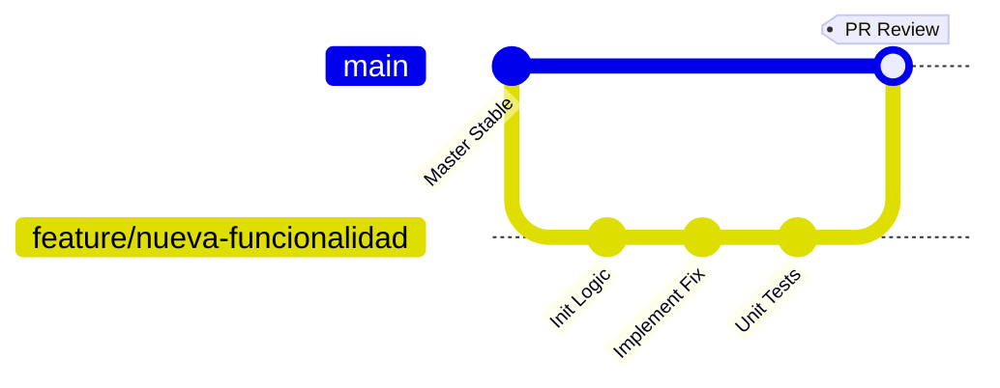
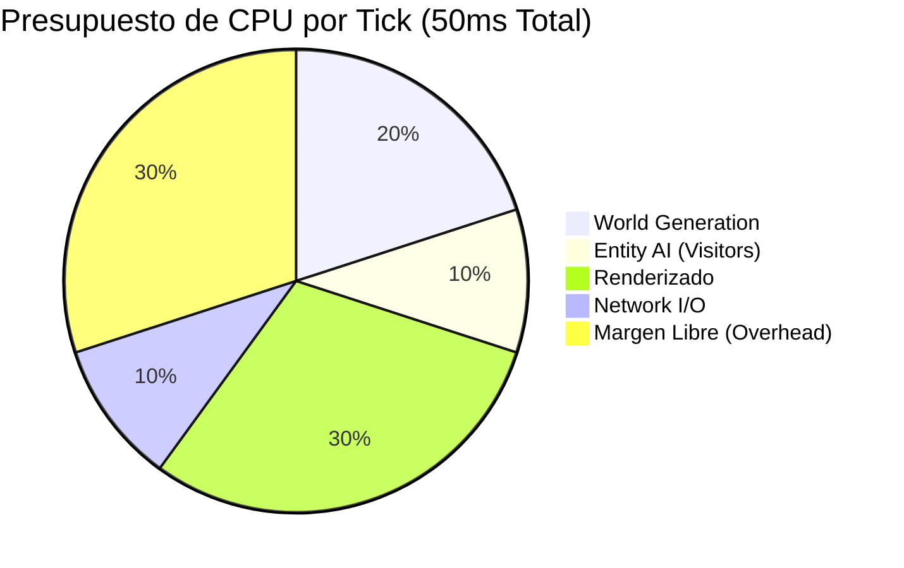

# 🤝 Guía de Contribución Técnica - Visitors Mod


¡Gracias por tu interés en colaborar con la arquitectura del **Visitors Mod**! Valoramos enormemente las contribuciones de la comunidad técnica para optimizar y escalar este proyecto.

---

## 🛠️ Flujo de Trabajo (Git Workflow)

Para mantener la integridad del código base y asegurar un historial limpio, utilizamos un modelo de ramas estricto ("Feature Branch Workflow").



### Protocolo de Contribución Paso a Paso

1.  **Fork del Repositorio**: Crea una bifurcación del repositorio en tu cuenta de GitHub para tener tu propia copia de trabajo.

2.  **Inicialización de Rama**: Crea una nueva rama (branch) siguiendo la nomenclatura semántica. Nunca trabajes directamente sobre `main` o `master`.
    *   `feature/nombre-funcionalidad` (Nuevas mecánicas, bloques o entidades)
    *   `fix/bug-critico` (Corrección de errores, crashes)
    *   `refactor/optimizacion-render` (Mejoras de código sin cambios lógicos)
    
    ```bash
    git checkout -b feature/sistema-pathfinding-mejorado
    ```

3.  **Desarrollo**: Implementa tus cambios siguiendo los estándares de calidad:
    *   **Clean Code**: Código limpio, legible y autoexplicativo.
    *   **Javadoc**: Documentación técnica obligatoria en métodos públicos y clases complejas.
    *   **SOLID**: Adherencia a principios de diseño orientado a objetos (especialmente Single Responsibility).

4.  **Testing Local**: Verifica la compilación y ejecuta los tests unitarios en tu entorno de desarrollo (IDE) antes de subir cambios.
    ```bash
    ./gradlew build check
    ```

5.  **Pull Request (PR)**: Envía tu solicitud a la rama `main` del repositorio original con una descripción técnica detallada de los cambios.

---

## 🐛 Reporte de Incidencias (Bug Tracking)

Si detectas una anomalía, *crash* o comportamiento inesperado, por favor abre un **Issue** siguiendo nuestra matriz de prioridad.

### Matriz de Prioridad de Bugs
```text
Gravedad (Impacto Técnico)
^
| [CRITICAL]    [HIGH]      [MODERATE]
| Crash Serv    Memory Leak Glitch Visual
| (Prioridad 1) (Prioridad 2) (Prioridad 3)
|
| [HIGH]        [MODERATE]  [LOW]
| Dupe Item     Lag Spike   Typo/Texto
| (Prioridad 2) (Prioridad 3) (Prioridad 4)
+--------------------------------------> Frecuencia
```

### Plantilla Requerida para Issues
Al abrir un Issue, incluye obligatoriamente la siguiente información técnica:

*   **Entorno**: 
    *   Versión del Mod (ej. 1.2.0)
    *   Versión de Forge/NeoForge
    *   Versión de Java (ej. OpenJDK 21)
*   **Reproducción**: Pasos deterministas (paso a paso) para replicar el error en un entorno limpio.
*   **Logs**: Adjunta el `debug.log` o el `crash-report` completo (Utiliza Gist o Pastebin, **no** pegues el texto plano en el issue).
*   **Evidencia**: Capturas de pantalla o perfiles de rendimiento de *Spark* (si es un problema de TPS/Lag).

---

## 📊 Estándares de Rendimiento

Aceptamos contribuciones que mejoren o mantengan el rendimiento actual. El mod opera bajo un presupuesto estricto de milisegundos por tick (MSPT).


*Cualquier PR que introduzca lógica pesada en la IA de los visitantes y exceda el presupuesto de 5ms deberá incluir una justificación de optimización o uso de hilos asíncronos.*

---

## ⚖️ Código de Conducta

Este proyecto se adhiere al **Contributor Covenant**. Se espera un comportamiento profesional, respetuoso y colaborativo entre todos los ingenieros y usuarios.

*   No toleramos el acoso, la discriminación ni el lenguaje ofensivo.
*   El *Code Review* debe ser constructivo, basado en argumentos técnicos y nunca un ataque personal.

---

**¡Happy Modding & Coding!** ☕