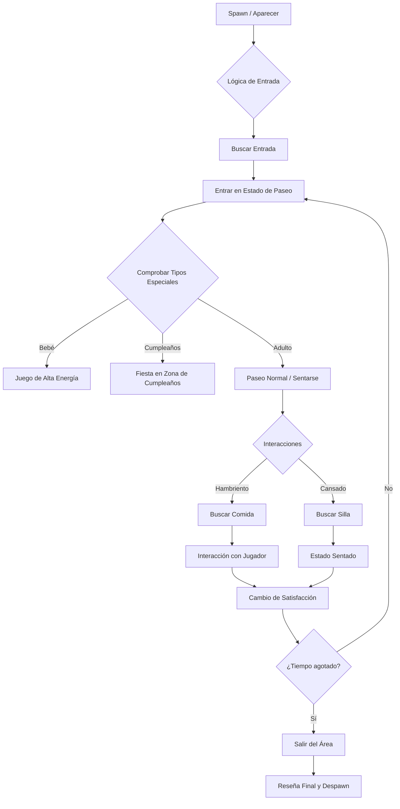

# � Mod de Visitantes para Pizzerías: El Ecosistema Definitivo (v1.2.0)

El **Mod de Visitantes** es un sistema sofisticado de NPCs diseñado para transformar construcciones estáticas de Minecraft en entornos de negocio dinámicos y vivos. Desarrollado específicamente para la **Simulación de Pizzerías**, incluye una IA de alto rendimiento, un sistema de reputación basado en méritos y comportamientos sociales complejos.

---

## 📊 Descripción General del Sistema

El mod opera sobre una arquitectura de máquina de estados que gobierna cada aspecto del ciclo de vida de un NPC, desde su aparición hasta su partida.

### Flujo del Ciclo de Vida del NPC

---

## 🛠 Características Detalladas

### 1. 🧠 IA Adaptativa de Alto Rendimiento
Diseñada para manejar despliegues masivos de NPCs sin hundir los TPS del servidor.
- **Ticking Adaptativo**: Los cálculos complejos (iluminación, multitud, espacio) están limitados a intervalos de 100 ticks (5 segundos).
- **IA Consciente del Lag**: Los NPCs detectan el MSPT del servidor; si hay lag, aumentan sus tiempos de espera para preservar recursos.
- **Caché Inteligente**: Se han implementado sistemas de caché para los AABB de las áreas y datos guardados para evitar bloqueos en el hilo principal.

### 2. ⭐ Sistema Dinámico de Reputación y Reseñas
Tu negocio vive o muere por su calificación.
- **Variables de Satisfacción**: Los niveles de luz, la densidad de gente y el espacio por persona influyen directamente en el humor del NPC.
- **Bonos de Reputación**: Capturar fugitivos añade un "Bono de Reputación" que ayuda a mejorar las reseñas de futuros clientes.
- **Mejora de Reseñas**: Una alta reputación aumenta la probabilidad de que un NPC mejore su calificación final (ej: convertir una reseña de 4★ en 5★).

### 3. 🪑 Sistema de Asientos (v1.2.0)
Los NPCs ya no solo se quedan de pie.
- **Registro de Sillas**: Usa `/visitorschair add` para definir bloques como asientos interactivos.
- **Lógica de Ocupación**: Los NPCs bloquean las sillas dinámicamente mediante UUID, evitando que dos entidades se solapen.
- **Recuperación**: Estar sentado proporciona un pequeño impulso de satisfacción con el tiempo.

### 4. 🌙 Emergencias y Criminalidad (Sistema "Killer")
No todos los visitantes son amigables.
- **Fugitivos**: Atraparlos te recompensa con **FazBucks** y reputación.
- **Medidas Defensivas**: Los NPCs tipo "Killer" son ahora plenamente funcionales, con atributos de ataque corregidos y efectos visuales de brillo para su identificación.

---

## 📋 Lista Completa de Comandos

| Comando | Permiso | Descripción |
|:---|:---:|:---|
| `/stars` | Todos | Muestra la calificación actual de 5 estrellas y el conteo de reseñas. |
| `/visitorspos1/2` | Admin | Define las esquinas de la zona de servicio principal. |
| `/visitorschair add` | Admin | Marca el bloque bajo el jugador como un asiento válido. |
| `/visitorschair clear`| Admin | Borra todos los datos de sillas del mundo. |
| `/visitorbirthday` | Admin | Fuerza un evento de cumpleaños con spawns grupales. |
| `/visitorsmax <n>` | Admin | Ajusta el límite global de densidad de NPCs. |
| `/visitorsclear` | Admin | Comando de emergencia para purgar todos los visitantes activos. |

---

## ⚙️ Arquitectura Técnica

### Persistencia de Datos
Utiliza `VisitorsSavedData` (API `SavedData` de Minecraft) para asegurar que la configuración de tu restaurante, las posiciones de las sillas y las calificaciones persistan tras reiniciar el servidor.

### Redes (Networking)
- **Sincronización de Calificaciones**: `S2CRatingSyncPacket` mantiene a los clientes actualizados.
- **Monitor de Rendimiento**: `S2CPerformancePacket` envía datos de TPS/MSPT del servidor al HUD del cliente en tiempo real.

---

## 🤝 Contribuciones y Licencia

¡Valoramos a la comunidad! Por favor, lee nuestro archivo [CONTRIBUTING.md](CONTRIBUTING.md) para más detalles sobre nuestro código de conducta.

Este proyecto está bajo la **Licencia MIT** - mira el archivo [LICENSE](LICENSE) para más detalles.

---
*Desarrollado con ❤️ para servidores basados en FNAF.*
